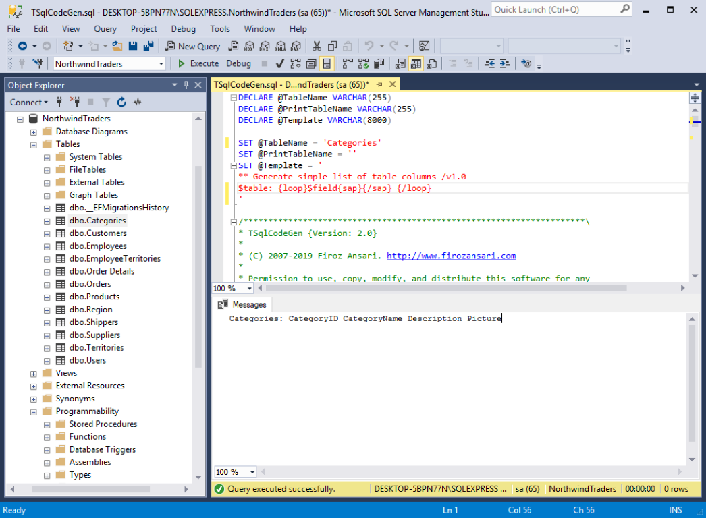
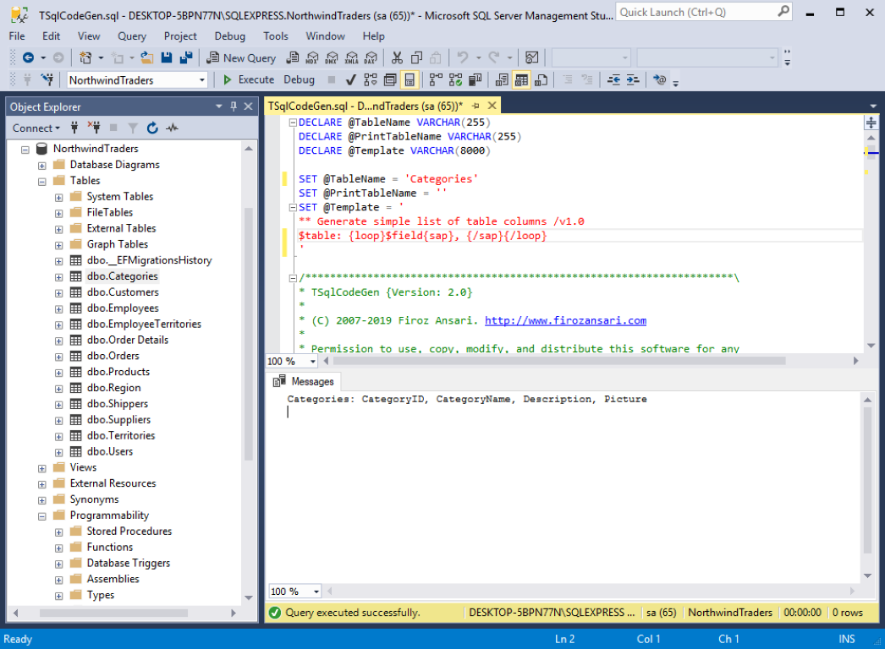
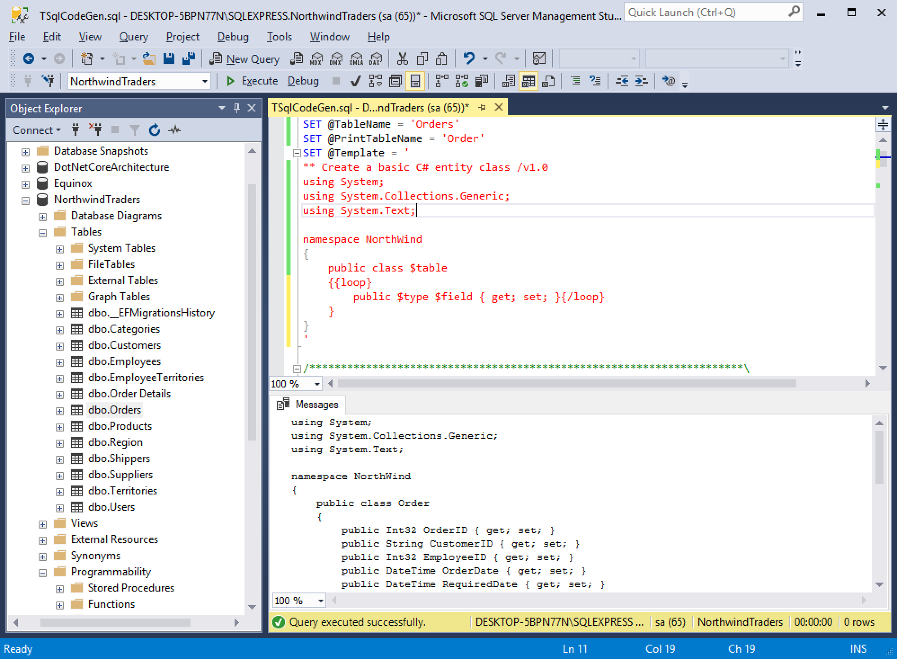

# TSqlCodeGen

TSqlCodeGen is a simple template based SQL script code generator which generates code using table structure. Provide your target table and template to the TSqlCodeGen and it will generate code you for based on your template. The tool is very handy if you are dealing with a table with a large number of columns.

## How To
Open TSqlCodeGen script in the SQL Management Studio, provide your table name and template, press F5 to execute TSqlCodeGen and have your code generated in result Pane. 
Copy generated code from the result pane and paste in your project.


You can create you own TSqlCodeGen template using following tags.

``` sql

$table    : Table name
$field    : Column Name
$type     : .NET Data Type
$sp_type  : SQL Data Type
$default  : .NET Default Value
$length   : Column Max Length

{loop}    : Start Loop Tag
{/loop}   : End Loop Tag

{sap}     : Separator Start Tag
{/sap}    : Separator End Tag

```

## Usage
To understand TSqlCodeGen usage, let's use a basic template which will generate a simple list of columns appended after the table name. 

``` sql
SET @Template = '
** Generate simple list of table columns /v1.0
$table: {loop}$field{sap}{/sap} {/loop}
'
```

Generated Code:
```
Categories: CategoryID CategoryName Description Picture
```



Now, let's modify the above template so that we can also include a comma after each column names except last one. Note the space after comma in the template and how it translates in the generated code.

``` sql
SET @Template = '
** Generate simple list of table columns saprated by comma /v1.0
$table: {loop}$field{sap}, {/sap} {/loop}
'
```

Generated Code:

```
Categories: CategoryID, CategoryName, Description, Picture
```



**Note**: the First line of the template is a comment line which will be ignored by TSqlCodeGen. You can use the first line of the template to document your template or provide additional information like template description, author, template version, additional comment, etc.

You can play around making changes in the template to explorer more about the tool.

## Examples
**1. List all fields of the table in a separate line**

``` sql
$table Fields:
{loop}$field{sap},{/sap}
{/loop}
```

Generated Code:

```
Categories Fields:
CategoryID,
CategoryName,
Description,
Picture
```

**2. Create a SELECT Statement**

``` sql
SELECT {loop}$field{sap},{/sap}{/loop}
FROM $table
```

Generated Code:

```
SELECT CategoryID,CategoryName,Description,Picture
FROM Categories
```

**3. Create a UPDATE statement**

``` sql
UPDATE $table
SET {loop}$field = @$field{sap},{/sap}
{/loop}
```

Generated Code:

```
UPDATE Categories
SET CategoryID = @CategoryID,
CategoryName = @CategoryName,
Description = @Description,
Picture = @Picture
```

**4. Create a UPDATE Stored Procedure**

``` sql
CREATE PROCEDURE [dbo].[usp_Update$table]{loop}
@$field = $sp_type{sap},{/sap}{/loop}
AS
BEGIN
 
	UPDATE dbo.$table WITH (ROWLOCK)
	SET {loop}
	$field = @$field{sap},{/sap}{/loop}
	WHERE --TODO
 
	RETURN -1
END
```

Generated Code:

```
CREATE PROCEDURE [dbo].[usp_UpdateCategories]
@CategoryID = INT,
@CategoryName = NVARCHAR(15),
@Description = NTEXT,
@Picture = IMAGE
AS
BEGIN
 
	UPDATE dbo.Categories WITH (ROWLOCK)
	SET 
	CategoryID = @CategoryID,
	CategoryName = @CategoryName,
	Description = @Description,
	Picture = @Picture
	WHERE --TODO
 
	RETURN -1
END
```

**5. Create a INSERT statement**

``` sql
INSERT INTO $table ({loop}[$field]{sap}, {/sap}{/loop}
VALUES ({loop}@$field{sap}, {/sap}{/loop})
```

Generated Code:

```
INSERT INTO Categories ([CategoryID], [CategoryName], [Description], [Picture]
VALUES (@CategoryID, @CategoryName, @Description, @Picture)
```

**6. Create a C# data access code snippet to entity value to respective stored procedure parameters**

``` sql
SqlDatabase database = new SqlDatabase(this._connectionString);
DbCommand commandWrapper = StoredProcedureProvider.GetCommandWrapper(database, "dbo.$table_Update", _useStoredProcedure);
{loop}database.AddInParameter(commandWrapper, "@$field", DbType.$type, entity.$field );
{/loop}
```

Generated Code:

```
SqlDatabase database = new SqlDatabase(this._connectionString);
DbCommand commandWrapper = StoredProcedureProvider.GetCommandWrapper(database, "dbo.Categories_Update", _useStoredProcedure);
database.AddInParameter(commandWrapper, "@CategoryID", DbType.Int32, entity.CategoryID );
database.AddInParameter(commandWrapper, "@CategoryName", DbType.String, entity.CategoryName );
database.AddInParameter(commandWrapper, "@Description", DbType.?ntext, entity.Description );
```

**7. Create a C# entity class**

``` sql
** Create a basic C# entity class /v1.0
using System;
using System.Collections.Generic;
using System.Text;

namespace NorthWind
{
    public class $table
    {{loop}
		public $type $field { get; set; }{/loop}}
	}
}
```

Generated Code:

```
using System;
using System.Collections.Generic;
using System.Text;

namespace NorthWind
{
    public class Order
    {
		public Int32 OrderID { get; set; }
		public String CustomerID { get; set; }
		public Int32 EmployeeID { get; set; }
		public DateTime OrderDate { get; set; }
		public DateTime RequiredDate { get; set; }
		public DateTime ShippedDate { get; set; }
		public Int32 ShipVia { get; set; }
		public Double Freight { get; set; }
		public String ShipName { get; set; }
		public String ShipAddress { get; set; }
		public String ShipCity { get; set; }
		public String ShipRegion { get; set; }
		public String ShipPostalCode { get; set; }}
	}
}
```



## License
The MIT License

Copyright (c) 2007-2019 Firoz Ansari. http://firozansari.com

THE SOFTWARE IS PROVIDED "AS IS", WITHOUT WARRANTY OF ANY KIND, EXPRESS OR
IMPLIED, INCLUDING BUT NOT LIMITED TO THE WARRANTIES OF MERCHANTABILITY,
FITNESS FOR A PARTICULAR PURPOSE AND NONINFRINGEMENT. IN NO EVENT SHALL THE
AUTHORS OR COPYRIGHT HOLDERS BE LIABLE FOR ANY CLAIM, DAMAGES OR OTHER
LIABILITY, WHETHER IN AN ACTION OF CONTRACT, TORT OR OTHERWISE, ARISING FROM,
OUT OF OR IN CONNECTION WITH THE SOFTWARE OR THE USE OR OTHER DEALINGS IN
THE SOFTWARE.
